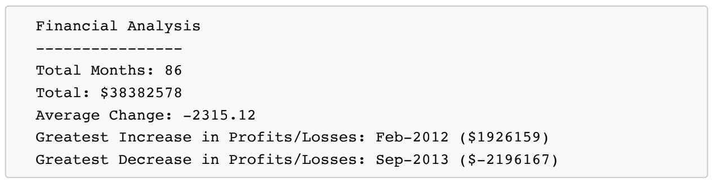

# console-finances
This repository involves code that analyzes the financial records of a company.

Coding instructions:
You have been given a dataset composed of arrays with two fields, Date and Profit/Losses.
Your task is to write JavaScript code that analyzes the records to calculate each of the following:
    The total number of months included in the dataset.
    The net total amount of Profit/Losses over the entire period.
    The average of the changes in Profit/Losses over the entire period.
        You will need to track what the total change in Profit/Losses are from month to month and then find the average.
        ( Total/(Number of months - 1) )
    The greatest increase in Profit/Losses (date and difference in the amounts) over the entire period.
    The greatest decrease in Profit/Losses (date and difference in the amounts) over the entire period.
When the code is opened in the browser, the resulting analysis should look similar to the following:
    

Here is the link to the deployed application:
https://swu664.github.io/console-finances/